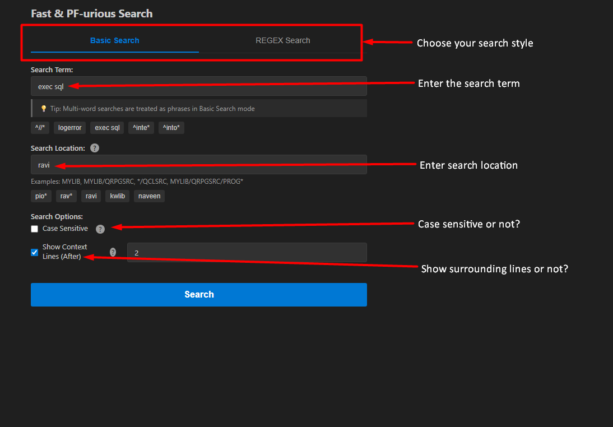
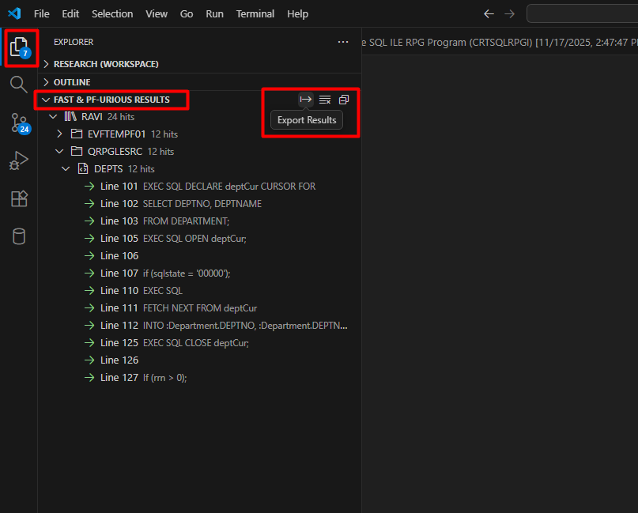
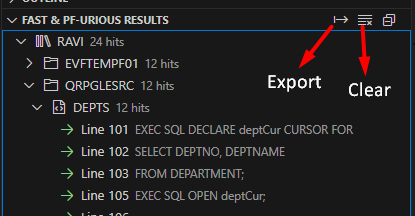

# Fast & PF-urious Search for IBM i

A lightning-fast VS Code extension that brings the power of PFGREP to your IBM i source code searches. Search millions of lines across hundreds of libraries in seconds.

**Stop doing this**: `STRPDM → Library 1 → Option 25 → Search → Close → Repeat for Library 2 → Repeat for Library 3...`

**Start doing this**: `Ctrl+Alt+F → Type pattern → Search all libraries at once → Click result → Jump to code`

---

## Installation

### Prerequisites
✅ **Code for IBM i Extension**: Must be installed and connected to your IBM i system
✅ **PFGREP Utility**: Must be installed on your IBM i system. You need to install it once

##### How to Install PFGREP on IBM i?
You only need to do this **once per IBM i system**. 
Connect to your IBM i terminal (SSH or QP2TERM) and run:
1. **Run this command:**
   ```bash
   /QOpenSys/pkgs/bin/wget https://github.com/SeidenGroup/pfgrep/releases/download/v0.5.1/pfgrep-0.5.1-0seiden.ibmi7.2.ppc64.rpm && /QOpenSys/pkgs/bin/yum install pfgrep-0.5.1-0seiden.ibmi7.2.ppc64.rpm
   ```
2. **Verify installation:**
   ```bash
   which pfgrep
   # Should return: /QOpenSys/pkgs/bin/pfgrep


### Install Extension
1. Install "Fast & PF-urious Search" from VS Code Marketplace
2. Ensure you have an active IBM i connection via Code-for-i
3. Press `Ctrl+Alt+F` to start searching!


---

### Step 2: Open the Search Dialog

Press `Ctrl+Alt+F` anywhere in VS Code



*The search dialog showing pattern input, library selection, and options*

---

### Step 3: View Your Results

Results appear in the **File Explorer** (left sidebar) under a new section called "Fast &PF-URIOUS results":


*Results appear in the Explorer sidebar with library → file → member hierarchy*

**Click any line** → Opens that member with your cursor on that exact line! 🎯

---

## 📊 Understanding Your Results

### What You See

Each result shows:
- **Library name** (📚 icon) with total match count
- **Source file** (📄 icon) grouped under each library
- **Member name** with **line number** and code snippet
- **Context lines** (if enabled) appear dimmed below each match

### What You Can Do

| Action | How |
|--------|-----|
| **Jump to code** | Click any result line - opens member at that exact line |
| **Export results** | Click the **→** button at top of results section |
| **Clear results** | Click the **×** button to remove results |
| **Expand/collapse** | Click arrows next to library/file names to organize view |


*The export (→) and clear (×) buttons at the top of the results panel*
* When you click the export button (→), a new editor window is opened with the search results in it.
* You can save this file anywhere for documentation or sharing with your team.

---

## 🔍 How to Search

### Basic Searches

**Simple text search** (case-insensitive by default):

```
Pattern: CUSTNO
Libraries: PRODLIB,TESTLIB
Result: Finds "custno", "CUSTNO", "CustNo", etc.

```

**Exact phrase with spaces:**

```
Pattern: EXEC SQL
Libraries: PROD*
Result: Auto-wrapped as "EXEC SQL" - finds the exact phrase
```

**Case-sensitive search:**
```
Pattern: CustNo
☑ Case Sensitive
Result: Only finds "CustNo", not "CUSTNO" or "custno"
```

### Library Patterns

You can use wildcards and combine multiple patterns:

| Pattern | What It Searches |
|---------|------------------|
| `MYLIB` | Only MYLIB |
| `PROD*` | All libraries starting with PROD |
| `MYLIB,YOURLIB` | Two specific libraries (comma-separated) |
| `MYLIB/QRPGLESRC/*` | Only the QRPGLESRC source file from MYLIB |


### Context Lines

Show surrounding code for better understanding:

```
Context Lines: 2
```

**Result:**
```
CUSTPGM (Line 142) - DCL-S custNo ZONED(7:0);  ← Your actual match
  (Line 143) -   custName = '';                ← Context line (dimmed)
  (Line 144) -   custAddr = '';                ← Context line (dimmed)
```

Context lines appear **dimmed** so you can easily distinguish them from actual matches.

---

## ⚙️ Search Options Explained

### Normal Search (Default)

- Searches for exact text (fastest and simplest)
- Multi-word phrases automatically wrapped in quotes

**Examples:**
```
SQL                  → Finds "SQL" anywhere in the code
EXEC SQL            → Auto-wrapped as "EXEC SQL" (exact phrase)
```

### Regex Search (Advanced)

- Full PCRE regex support for complex patterns
- More powerful but requires regex knowledge

**Examples:**
```
^DCL-               → Lines starting with DCL-
\bCUSTNO\b          → Whole word CUSTNO only (not CUSTNO1)
EXEC\s+SQL          → EXEC followed by SQL with any whitespace between EXEC and SQL
(SELECT|INSERT)     → Match either SELECT or INSERT
```

**💡 Pro tip:** Use Normal Search for most cases. It's faster and simpler. Switch to Regex only when you need advanced pattern matching.

### Other Options

- **Case Sensitive**: Match exact case only (default: OFF = case-insensitive)
- **Context Lines**: Show 0-50 lines after each match (default: 0)

---

## 🚀 Common Use Cases

### 1. Find Where a Field is Used
```
Pattern: CUSTNO
Libraries: PROD*
☐ Case Sensitive
☐ Smart-search (REGEX)

Result: All references to CUSTNO across all PROD libraries
```

### 2. Find SQL Statements
```
Pattern: EXEC SQL
Libraries: MYLIB,YOURLIB
☐ Case Sensitive
☐ Smart-search (REGEX)
Context Lines: 2

Result: All embedded SQL statements with 2 lines of context
```

### 3. Find Procedure Definitions (Regex)
```
Pattern: ^DCL-PROC
Libraries: *
☐ Case Sensitive
☑ Smart-search (REGEX)

Result: All lines starting with DCL-PROC (procedure definitions)
```

### 4. Compare Across Environments
```
Pattern: CUSTFILE
Libraries: PRODLIB,QALIB,DEVLIB
☐ Case Sensitive

Result: See where CUSTFILE is referenced in each environment
```

### 5. Find API Calls
```
Pattern: QCMDEXC
Libraries: MYLIB*
Context Lines: 3

Result: All QCMDEXC calls with surrounding code for context
```

---

## ❓ Troubleshooting

### "PFGREP is not installed" Error

**This is the #1 most common issue!** PFGREP must be installed on your IBM i system.

**Solution:**
1. Connect to IBM i terminal (SSH or 5250)
2. Run this command:
   ```bash
   wget https://github.com/SeidenGroup/pfgrep/releases/download/v0.5.1/pfgrep-0.5.1-0seiden.ibmi7.2.ppc64.rpm && yum install pfgrep-0.5.1-0seiden.ibmi7.2.ppc64.rpm
   ```
3. Verify installation works:
   ```bash
   which pfgrep
   # Should return: /QOpenSys/pkgs/bin/pfgrep
   ```
4. Restart VS Code
5. Try your search again

### "Not connected to IBM i" Error

**You must be connected via the Code for IBM i extension first.**

**Solution:**
1. Look at the bottom status bar of VS Code
2. Click the IBM i connection icon
3. Select "Connect to IBM i system"
4. Enter your credentials
5. Wait for connection to complete
6. Try search again

### "Don't have authority to that library" Error

**You don't have read access to one or more libraries in your search pattern.**

**Solution:**
- Double-check library names for typos
- Verify you have `*USE` authority to those libraries on IBM i
- Try searching a library you definitely can access (like your personal library)
- Ask your system administrator to grant access if needed

### Results Not Appearing

**Checklist:**
1. ✅ Connected to IBM i? (Check status bar at bottom)
2. ✅ PFGREP installed? (Run `which pfgrep` on IBM i)
3. ✅ Library pattern correct? (No typos?)
4. ✅ You have authority to libraries?
5. ✅ Your pattern actually exists in those libraries?

**Quick test:**
```
Pattern: DCL-S
Libraries: [a library you know has RPG code]
```
If this works, your original pattern or library selection might be the issue.

### Search Takes Too Long

**If your search is running for a long time:**
- You might be searching too many libraries with `*`
- Try narrowing your library pattern (e.g., `PROD*` instead of `*`)
- Check if your pattern is too generic (e.g., searching for "A" will find almost everything)

---

## 📚 Reference

### Search Limits

- **Maximum matches per search:** 5,000 lines
- You'll receive a warning notification if this limit is reached
- If you hit the limit, consider:
  - Narrowing your library pattern
  - Making your search pattern more specific
  - Searching fewer libraries at once

### Comparison with Other Tools

| Feature | Fast & PF-urious | VS Code Built-in | IBM i RDi |
|---------|------------------|------------------|-----------|
| **Speed** | ⚡ Ultra-fast | 🐌 Slow over network | 🐌 Slow |
| **Multi-library** | ✅ One search | ❌ One at a time | ❌ Library-by-library |
| **Modern UI** | ✅ VS Code integration | ✅ VS Code | ❌ Eclipse-based |
| **Context lines** | ✅ Built-in | ❌ Not available | ❌ Not available |
| **Click to jump** | ✅ Direct to line | ✅ Yes | ✅ Yes |
| **Export results** | ✅ Text format | ❌ No | ❌ No |
| **Free** | ✅ Open source | ✅ Built-in | ❌ Licensed |
| **Regex support** | ✅ Full PCRE | ✅ Basic | ✅ Yes |

### Keyboard Shortcuts

| Shortcut | Action |
|----------|--------|
| `Ctrl+Alt+F` | Open search dialog (works anywhere in VS Code) |
| `Enter` | Execute search (when dialog is open) |
| `Escape` | Close dialog / Cancel search |

### Technology Stack

- **PFGREP**: Fast grep implementation optimized for IBM i physical files (by Seiden Group)
- **Code for IBM i**: Connection layer and file access to IBM i systems
- **VS Code API**: UI components, tree view, and editor integration

---

## 🤝 Contributing & Support

### Found a Bug or Have a Feature Idea?

- **File an issue**: [GitHub Issues](https://github.com/oliyan/fast-pfurious-search/issues) 
- **Contribute code**: Pull requests are welcome!
- **Share feedback**: Help make this extension better for the entire IBM i community

### Development Setup

Want to contribute? Here's how to get started:

1. Clone the repository
2. Run `npm install`
3. Open in VS Code
4. Press `F5` to launch Extension Development Host
5. Make your changes and test

### Special Thanks

🙏 **Programmers.io** - For constant inspiration and motivation  
🙏 **Seiden Group** - For porting GREP to IBM i (PFGREP utility)  
🙏 **Code-for-i Team** - For the communication layer that makes this possible  
🙏 **All Contributors** - For feedback and improvements that made this extension better

---

## 📝 License

This project is licensed under the GPL v3 License - see the [LICENSE](LICENSE) file for details.

---

## 🎯 Quick Reference Card

**Need help fast? Here are the essentials:**

| What | How |
|------|-----|
| **Open search** | `Ctrl+Alt+F` |
| **Results location** | File Explorer (left sidebar) → "FAST & PF-URIOUS Results" section |
| **Jump to code** | Click any result line |
| **Export results** | Click **→** button in results panel |
| **Clear results** | Click **×** button |
| **Most common error** | "PFGREP not installed" → Install PFGREP on IBM i (see Step 1B) |

**Pattern Examples:**
- `CUSTNO` = Simple text search
- `PROD*` = All libraries starting with PROD
- `^DCL-PROC` = Regex for lines starting with DCL-PROC (enable Smart-search checkbox)

**Still confused?** Re-read the **"Quick Start"** and **"Understanding Your Results"** sections above.

---


**Made with ❤️ for the IBM i developer community**